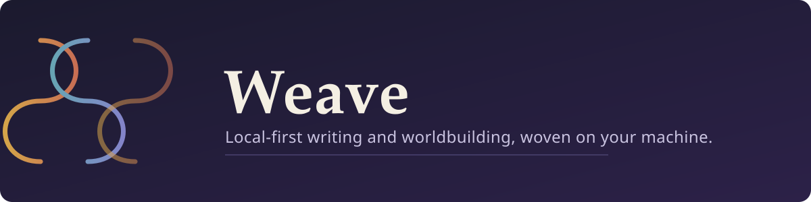

Weave is a local-only Tauri 2 desktop app for writing and worldbuilding. A React/TypeScript renderer talks through a typed repository contract and Tauri adapter; a Rust backend persists everything in SQLite and applies filesystem safeguards. Every opened project visibly stores its data in `<project>/.weave/` (`project.db`, `files/`, `backups/`, `exports/`). There is no cloud service, sync, AI, Docker runtime, or network dependency.

## Completed phases

- **Phase 1 — writing, persistence, and export:** canonical versioned structured documents, scene/chapter operations, SQLite persistence, revision checks, migrations, integrity checks, backups/recovery, and deterministic PDF, DOCX, Markdown, and plain-text export are implemented.
- **Writing UX, pagination, autosave, and goals:** document-sized reflowed pages, responsive editing, style settings, dialogs, debounced local autosave with retry/flush and recovery status, and persisted daily/project word goals are implemented.
- **Worldbuilding, page notes, and selectable canvases:** local Markdown notes open in persistent page-oriented writing surfaces, while each new story canvas explicitly chooses React Flow or Excalidraw. React Flow projections and Excalidraw scene state are persisted locally.
- **Markdown-notes-only React Flow clarification:** React Flow canvases limit nodes to Markdown notes and resolved Markdown links; previous generic worldbuilding entities, scene nodes, relationships, and freeform drawing are not part of that projection, and the legacy backend code for those entities has been removed.
- **Dark mode:** the renderer supports persisted light/dark themes with token-driven surfaces, editor controls, dialogs, and React Flow overrides.
- **Single global sidebar:** Manuscript, Worldbuilding, Outline, and Search share one workspace sidebar (a 2×2 navigation grid) instead of separate per-workspace sidebars.
- **Native project folder picker:** creating or opening a project uses the desktop OS's native folder picker (the Tauri dialog plugin) instead of a typed path; project directories are validated as absolute, and recent projects are remembered across sessions.

## Product patterns

- Canonical structured manuscript data is persisted separately from presentation settings such as font, spacing, and page size.
- Continuous-to-scene splitting is deterministic and recognizes only whole paragraphs containing `***` or `Nova cena`; no marker means no split.
- Autosave is local, revision-aware, and flushed on navigation, mode changes, exports, backups, and close; failed saves remain retryable. The Manuscript editor only renders once a scene actually exists and is selected, so nothing can be typed into an unbacked page.
- Markdown notes recognize only exact `[[Target]]` and `[[Target|label]]` links, with unique local-note resolution and repairable unresolved links. Notes keep Markdown as their canonical source while their editor is presented as paginated writing paper.
- Each canvas persists an explicit `react-flow` or `excalidraw` engine. Existing records migrate to `react-flow`; React Flow positions/viewport remain projection/layout data separate from note Markdown, while Excalidraw stores JSON-safe elements, app state, and local files with revision checks.
- The theme choice is presentation-only: it is stored in browser/webview local storage under `weave.theme`, never in the project repository, and defaults to light when absent or unavailable. The inline bootstrap applies a valid saved choice before the renderer loads to avoid a light-mode flash.

## Getting started

```sh
npm ci                   # install dependencies
npm test                 # run the test suite (vitest)
npm run build             # typecheck + production build (vite)
npm run desktop:dev       # run the desktop app (requires the Tauri 2 system toolchain)
npm run desktop:build     # build the desktop app (requires the Tauri 2 system toolchain)
```

If Vite reports `Failed to resolve import "@excalidraw/excalidraw"`, the local dependency tree is incomplete; run `npm ci` from the repository root before changing source imports. The Vite/browser fallback (`npm run dev`) uses the in-memory repository for UI work and shows an explicit "browser preview — nothing is saved" warning, since it never touches disk; the desktop build (`npm run desktop:dev` / `desktop:build`) uses SQLite through `src-tauri/` and is the only mode that actually persists a project.

Excalidraw uses the maintained `@excalidraw/excalidraw` **0.18.1** package (MIT license; peer-compatible with React 18). Its package-bundled CSS and font assets are shipped locally with the desktop bundle, so no runtime network or collaboration service is required. The engine is intentionally not tldraw or another substitute.

## Importing a folder project

Desktop import accepts a new local directory with exactly these top-level folders: `manuscript`, `outline`, and `worldbuilding`. It reads regular UTF-8 `.md` files only (subfolders are supported); source files are never modified. `manuscript` files become one chapter and scene each in a single imported story, `outline` files remain independent editable Outline Markdown files, and `worldbuilding` subfolders/Markdown become the matching folder/note hierarchy. Import rejects existing `.weave` storage, extra/missing top-level entries, symlinks, invalid UTF-8, files over 10 MiB, and more than 2,000 Markdown files so it never merges into an existing project.

## Authoritative boundaries

| Path | Owns |
| --- | --- |
| `src/domain/` | Document types, deterministic scene rules, goals, pagination, autosave, and the repository contract |
| `src/infrastructure/` | The SQLite repository and typed Tauri adapter |
| `src/export/` | Deterministic editorial exporters |
| `src/app/` | Renderer and UI behavior, including the Worldbuilding workspace and React Flow projection |
| `src-tauri/` | Rust commands and desktop filesystem/SQLite integration |

## Planned roadmap

Both items previously listed here have shipped and now live under Completed phases above: the single-sidebar UX correction, and native file-picker support for choosing project folders. No further roadmap items are currently queued; recent work has been bug fixes and polish on existing features (autosave/save-loss fixes, Worldbuilding legacy-code cleanup, and UI consistency fixes).

## Support

If you enjoyed the project, you can leave a small donation on Ko-fi.

<a href='https://ko-fi.com/juulius' target='_blank'></a>

## License

Weave is released under the [MIT License](LICENSE).
